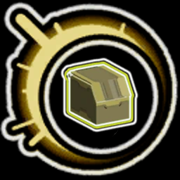

# ScrappyChests

ScrappyChests is a Risk of Rain 2 mod that replaces the drops of chests and mobs to drop scrap instead of items. The player has to use printers to find regular items.

## Installation

## Features

Each feature can be enabled or disabled in the game menu `Settings > Mod Options > ScrappyChests`.

|Category|Name|Default|Description|
|--|--|--|--|
|Configuration|Mod enabled|Enabled|Mod enabled|
|Chests|Chest|Enabled|Chest will drop scrap instead of items|
|Chests|Multishop Terminal|Enabled|Multishop Terminal will drop scrap instead of items|
|Chests|Adaptive Chest|Enabled|Adaptive Chest will drop scrap instead of items|
|Chests|Shrine of Chance|Enabled|Shrine of Chance will drop scrap instead of items|
|Chests|Legendary Chest|Enabled|Legendary Chest will drop scrap instead of items|
|Items|Rusted Key|Disabled|Lockboxs will drop scrap instead of items|
|Items|Crashed Multishop|Disabled|Crashed Multishop will drop scrap instead of items|
|Chests|Void Potential|Enabled|Void Potential will drop scrap instead of items|
|Chests|Lunar Pod|Disabled|Lunar Pod will drop Beads of Fealty instead of items|
|Chests|Lunar Bud|Disabled|Lunar Bud in the Bazaar Between Time will always sell Beads of Fealty|
|Mobs|Boss|Enabled|Defeating a Boss will drop scrap instead of items|
|Mobs|Trophy Hunters Tricorn|Disabled|Trophy Hunter's Tricorn will drop scrap instead of items|
|Mobs|Alloy Worship Unit|Enabled|Alloy Worship Unit will drop scrap instead of items|
|Mobs|Scavenger|Disabled|Scavenger will drop scrap instead of items|
|Mobs|Elite Elder Lemurian|Disabled|The Elite Elder Lemurian in the hidden chamber of Abandoned Aqueduct will drop scrap instead of bands|
|Artifacts|Relentless Doppelganger|Disabled|The Relentless Doppelganger from the Artifact of Vengeance will drop scrap instead of items|
|Artifacts|Artifact of Sacrifice|Enabled|When using the Artifact of Sacrifice, the mobs will drop scrap instead of items|
|Waves|Simulacrum|Enabled|The orb reward after each wave of Simulacrum will drop scrap instead of items|
|Waves|Void Fields|Enabled|The orb reward after each wave of the Void Fields will drop scrap instead of items|
|Tiers|White item|Enabled|Replace white item drops with white scrap|
|Tiers|Green item|Enabled|Replace green item drops with green scrap|
|Tiers|Red item|Enabled|Replace red item drops with red scrap|
|Tiers|Yellow item|Enabled|Replace yellow item drops with yellow scrap|
|Tiers|Blue item|Enabled|Replace blue item drops with Beads of Fealty|